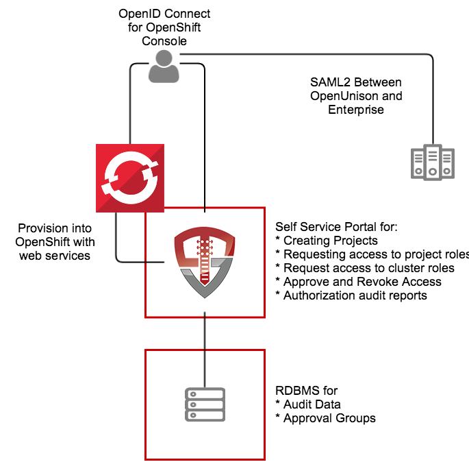

# OpenShift Self Service Portal

This application, built on OpenUnison, is a self service portal for Red Hat's OpenShift and OKD.  It provides a single interface for:

1. Authentication via SAML2, multiple LDAP directories, add compliance acknowledgment, etc
2. Self service portal for requesting access to and getting approval for individual projects
3. Self service requests for gaining cluster level roles
4. Support removing users' access
5. Reporting

The portal runs inside of OpenShift, leveraging OpenShift for scalability and secret management.  

The OpenUnison deployment stores all OpenShift access information as a group in OpenShift, as opposed to a group in an external directory.  The only groups stored outside of OpenShift are approval groups which are stored in the relational database.

# Roles Supported

## Cluster

1.  Administration - Full cluster management access

## Projects

1.  Admin - Can edit and deploy into a project, can not change project annotations
2.  View - Can view contents of a project, but can not make changes

## Non-OpenShift

1.  System Approver - Able to approve access to roles specific to OpenUnison
2.  Auditor - Able to view audit reports, but not request projects or approve access

# Deployment

Detailed deployment instructions are at https://github.com/TremoloSecurity/OpenUnison/wiki/OpenShift-Access-Portal

# Whats next?
Now you can begin mapping OpenUnison's capabilities to your business and compliance needs.  For instance you can add multi-factor authentication with TOTP or U2F, Create privileged workflows for onboarding, scheduled workflows that will deprovision users, etc.
